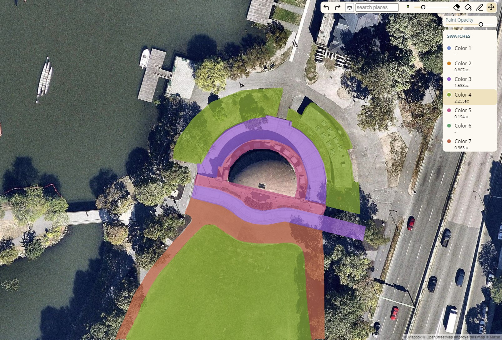

# paint-the-map

## Overview

PaintTheMap provides a simple, familiar painting interface to help lower the burden for interacting with geospatial tools. Painted pixels can be used for take-offs to inform numeric models - or combined with raster data to run analysis.

## How it works

Under the hood, PaintTheMap uses a canvas that lets the user draw in screen-space over any map. As soon as the brush stroke is completed the ‘paint’ is transferred into the map tiles beneath the canvas on the current layer and areas are recalculated using a webworker.

When the user adjusts the map by panning or zooming, the reverse happens: paint from the map tiles is transferred onto the drawing canvas. The result is a seamless, global painting experience where the scale of each pixel is understood.

## Usage

### Paint Tools

The paint tools let you paint onto a canvas much like any paint tool. As soon as a paint operation is complete, a web worker will begin re-counting pixels in the background. The area will be shown in the "swatches" list.

#### Pan tool
Pan and zoom the map (default leaflet map behavior).

#### Marker
Paint pixels with a square-shaped brush. Use the slider to modify the marker paint size. Note this is zoom dependent. You get finer brush details as you zoom in.

Useful shortcuts:
* Shift+Click to draw straight line segments.
* Ctrl+Click when in marker mode to fill using Paint Bucket tool.
* Spacebar: temporarily enable pan mode while spacebar is down. Release spacebar to return to tool.

#### Eraser
The eraser provides the same controls and shortcuts as the marker to erase content.

#### Paint Bucket 
Fill an enclosed area with the selected paint color.

## Example

See examples/paint-tool for a simple example with configurable options.

